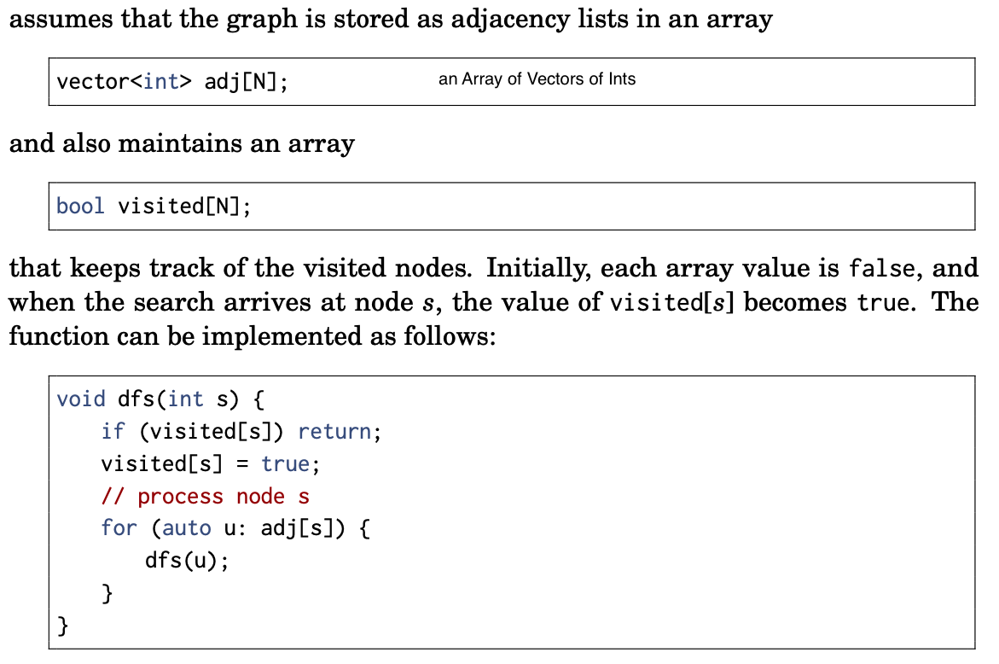
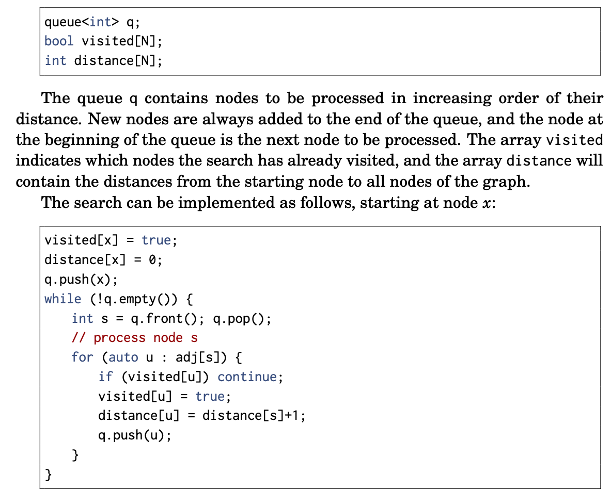
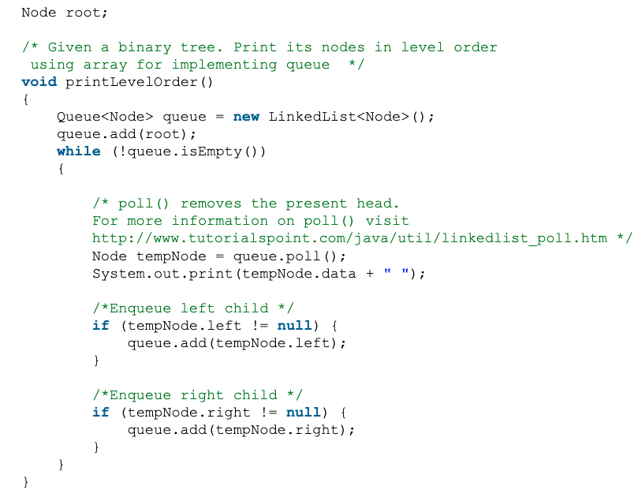
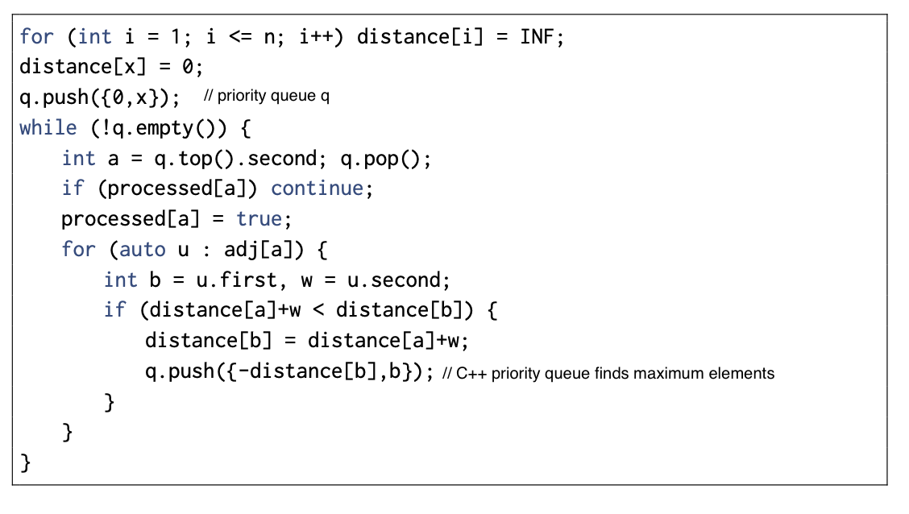

# crackingTheCodingInterviewBook

Following is my notes and source code when reading crackingTheCodingInterviewBook 
and practicing mostly on platforms like Leetcode.

## current progress: 
p. 137

## solutions to problems
| #    | Title                                                             | Data Structures etc.                       |
| :--- | :---------------------------------------------------------------- | :------------------------------------------|
|  78  | [subsets][78]                                               | backtracking                                        |
|  47  | [permute-unique][47]                                               | backtracking                                        |
|  239 | [max-sliding-window][239]                                         | LinkedList                                 |
| 1670 | [front-middle-back-queue][1670]                                   |                                            |
| 1684 | [CountConsistentStrings][1684]                                    | Hash Table                                 |
| 1812 | [square-is-white][1812]                                           |                                            |
| 1800 | [max-ascending-sum][1800]                                         |                                            |
| 1813 | [are-sentences-similar][1813]                                     | LinkedList                                 |
| 1814 | [count-nice-pairs-in-an-array][1814]                              | Hash Table                                 |
| 1815 | [max-happy-groups][1815]                                          | dfs, dp                                    |
| 1816 | [truncate-sentence][1816]                                         |                                            |
| 1817 | [finding-users-active-minutes][1817]                              | Hash Table                                 |
| 1818 | [min-absolute-sum-diff][1818]                                     |                                            |
| 1822 | [array-sign][1822]                                                |                                            |
| 1823 | [find-the-winner][1823]                                           |                                            |
| 1824 | [min-side-jumps][1824]                                            |                                            |
| 1825 | [m-k-average][1825]                                               | Binary Search, maxSlidingWindow (239)            |
| 1827 | [min-operations][1827]                                               |              |
| 1828 | [count-points][1828]                                               |              |
| 1829 | [get-maximum-xor][1829]                                               |              |
| 1832 | [check-if-pangram][1832]                                               |              |
| 1833 | [max-ice-cream][1833]                                               |              |
| 1837 | [sum-base][1837]                                               |              |
| 1844 | [replace-digits][1844]                                               |              |
| 1845 | [seat-manager][1845]                                               |              |
| 1846 | [maximum-element-after-decrementing-and-rearranging][1846]                                               |              |
|      | [list-of-string-permutations][listOfStringPermutations]           | dfs                                        |

[listOfStringPermutations]: https://github.com/geyuqiu/kata-bootstraps/blob/master/java/junit5/src/main/java/crackingTheCodingInterview/listOfStringPermutations.java
[47]: https://github.com/geyuqiu/kata-bootstraps/blob/master/java/junit5/src/main/java/leetcode/PermuteUnique.java
[78]: https://github.com/geyuqiu/kata-bootstraps/blob/master/java/junit5/src/main/java/leetcode/Subsets.java
[239]: https://github.com/geyuqiu/kata-bootstraps/blob/master/java/junit5/src/main/java/leetcode/MaxSlidingWindow.java
[1670]: https://github.com/geyuqiu/kata-bootstraps/blob/master/java/junit5/src/main/java/leetcode/FrontMiddleBackQueue.java
[1684]: https://github.com/geyuqiu/kata-bootstraps/blob/master/java/junit5/src/main/java/leetcode/CountConsistentStrings.java
[1800]: https://github.com/geyuqiu/kata-bootstraps/blob/master/java/junit5/src/main/java/leetcode/MaxAscendingSum.java
[1812]: https://github.com/geyuqiu/kata-bootstraps/blob/master/java/junit5/src/main/java/leetcode/SquareIsWhite.java
[1813]: https://github.com/geyuqiu/kata-bootstraps/blob/master/java/junit5/src/main/java/leetcode/AreSentencesSimilar.java
[1814]: https://github.com/geyuqiu/kata-bootstraps/blob/master/java/junit5/src/main/java/leetcode/CountNicePairs.java
[1815]: https://github.com/geyuqiu/kata-bootstraps/blob/master/java/junit5/src/main/java/leetcode/MaxHappyGroups.java
[1816]: https://github.com/geyuqiu/kata-bootstraps/blob/master/java/junit5/src/main/java/leetcode/TruncateSentence.java
[1817]: https://github.com/geyuqiu/kata-bootstraps/blob/master/java/junit5/src/main/java/leetcode/FindingUsersActiveMinutes.java
[1818]: https://github.com/geyuqiu/kata-bootstraps/blob/master/java/junit5/src/main/java/leetcode/MinAbsoluteSumDiff.java
[1822]: https://github.com/geyuqiu/kata-bootstraps/blob/master/java/junit5/src/main/java/leetcode/ArraySign.java
[1823]: https://github.com/geyuqiu/kata-bootstraps/blob/master/java/junit5/src/main/java/leetcode/FindTheWinner.java
[1824]: https://github.com/geyuqiu/kata-bootstraps/blob/master/java/junit5/src/main/java/leetcode/MinSideJumps.java
[1825]: https://github.com/geyuqiu/kata-bootstraps/blob/master/java/junit5/src/main/java/leetcode/MKAverage.java
[1827]: https://github.com/geyuqiu/kata-bootstraps/blob/master/java/junit5/src/main/java/leetcode/MinOperations.java
[1828]: https://github.com/geyuqiu/kata-bootstraps/blob/master/java/junit5/src/main/java/leetcode/CountPoints.java
[1829]: https://github.com/geyuqiu/kata-bootstraps/blob/master/java/junit5/src/main/java/leetcode/GetMaximumXor.java
[1832]: https://github.com/geyuqiu/kata-bootstraps/blob/master/python/unittest/checkIfPangram.py
[1833]: https://github.com/geyuqiu/kata-bootstraps/blob/master/python/unittest/maxIceCream.py
[1837]: https://github.com/geyuqiu/kata-bootstraps/blob/master/python/unittest/sumBase.py
[1844]: https://github.com/geyuqiu/kata-bootstraps/blob/master/python/unittest/replaceDigits.py
[1845]: https://github.com/geyuqiu/kata-bootstraps/blob/master/python/unittest/seatManager.py
[1846]: https://github.com/geyuqiu/kata-bootstraps/blob/master/python/unittest/maximumElementAfterDecrementingAndRearranging.py

chapters to skip: 
* chapter 12: 158 - 163

## how to steps
* listen carefully for **CLUES**, all clues must be there to provide the optimal solutions
    * sorted
    * repeatedly --> think about caching
* Talk out loud, show what you think (when screen sharing use oneNote e.g.): like writing jira tickets, defining AK, asking about uncertainties
    * give opportunity to evaluate your thought process: give headlines when being quiet
    * the interview is on your side
    * communication skills
    * stumbling and struggling is normal
    * if writing code on a white Board: use the long variable first and then make if short 
* draw a (complex enough) example (frame/visualize what you understood in your own words)
    * try to avoid special cases
* explain a **brute force** asap (not code it), slow but works, **stating time and space complexity**
    * **data structure brainstorm**: e.g. LinkedList, HashMap etc.
        * stack
            * useful for backtracking, push temporary data onto a stack 
        as you recurse, but then remove them as you backtrack (for example, because the recursive check failed) 
            * use stack to implement a recursive algorithm iteratively
        * Queue
            * useful for BFS traversal
            * 
    * if brute force not possible, have there been any similar algorithms before that was solved
    * makes sense if misheard the concept / task
    * state the runtime: O()
    * e.g. count the intersection of 2 **sorted**, **distinct** lists
        * [1,12,15,19,20,21]
        * [2,15,17,19,21,25,27]
        * brute force: for each item in the first list, 
        try to find the same item in the second list, 
        if so increment the intersection variable,
        this will take O(A*B)
* **Optimize**:
    * mostly for medium or hard leetcode problems
    * Ideally, you want a question that has a series of hurdles, insights, or optimizations. 
        Multiple data points beat a single data point.
    * **BUD**: 
        * **B**ottlenecks: max complexity factor, e.g. O(nlogn) over O(n), 
        as the bottlenecks could change while getting from brute-force to an end algorithm
        * **u**nnecessary work: Print all positive integer solutions to the equation:
        a<sup>3</sup> + b<sup>3</sup> = c<sup>3</sup> + d<sup>3</sup> where a, b, c, and d are integers between 1 and 1000 
            * brute force O(n<sup>4</sup>)
            * add break
            * do: pow(a<sup>3</sup> + b<sup>3</sup> - c<sup>3</sup>, 1/3)
            * precompute `(c, d)` pair into hashtable, maps from sum to the list of pairs that have that sum: `HashMap<Integer, Pair<Integer, Integer>>` with O(n<sup>2</sup>) 
            * `(c, d)` pairs are computed for `(a, b)`: O(n<sup>2</sup>) 
        * **d**uplicated work
            * throw values in B in **hashset** (preparation): look up time O(1) --> runtime overall: 
                O(A+B) runtime, O(B) space complexity
            * binary search on B: O(log B) runtime, O(1) space complexity
            * use sorted as not yet used criteria and walk through A and B with two pointers (linear search): similar to merging these 2 sorted arrays:
                O(A+B) runtime, O(1) space complexity
    * Space and time **trade-offs**
        * more space complexity with pre-computations
    * simplify, generalize with multi-step approach
        * simplify: word -> string,    
    * Do it yourself (solve it like a 12 year old and reverse engineer it)
        * or find out similar problems that was done before, implement it first and start from there
        * find permutations of s within b
            * s = abbc
            * b = cbabadcbbabbcbabaabccbabc
            * brute force: find all permutations (S!) * look for each in b (B)
            * optimisation:
                * Walk through b and look at sliding windows of 4 characters (since s has length 4). Check if each window is a permutation of s
                * Walk through b.Every time you see a character ins, check if the next four(the length ofs) characters
                  are a permutation ofs.
                * O(B*S) 
        * binary search
            * search name in a dictionary without knowing the exact place of e.g. S, as a real world metaphor for binary search
    * recursion: base case and build
    * reuse variables, methods
    * export methods (modularity), not squashed in a huge one
    * combine with Best Conceivable Runtime (BCR) e.g. O(n)
        * Any work you do that's less than or equal to the BCR is **free**
        * optimize runtime and then space complexity one by one in order to get Best Conceivable Runtime in both complexity
* walk through / picture your data structures and variables and when they change

## before and during writing code: 

* write pseudo code as comments so that you don't forget everything that you thought of
* write code on paper / leetcode
* test n SMALL cases including 
    * edge cases
* type paper code into ide with unit tests:
note down the mistakes that are discovered by ide syntax highlighting, compiler and while debugging and keep them as a list, **also document them while coding in general** 
    * not using all given function params: increment 1 instead of the right function variable 
    * not using all given conditions 
    * Integer overflow while multiplying / adding `10^9*7` with `10^9*7`
    * optimize reduce time complexity (find the next **bottleneck**) and space complexity (array suffices) with well chosen test cases
    * **begins coding too early** before completing data structure brainstorm and though about every steps along the way
        * not understanding every detail of the problem
        * using the **wrong data structure**
            * not understanding the purpose of **every** constraint
        * not checking edge cases (base case, indexOutOfBounds e.g.)
        * missing return statement ...
        * comparing with the wrong element type in array
        * using / picked the wrong variable / number ... use to more temp variables
        * forget to set flag in helper array ...
        * index bounds, forgot if case in for loop
        * k+1, k-1 vs k etc.
        * garbage variables while refactoring
        * calling wrong method when dealing with multiple data structure in 1 class
        * division by zero
        * adding i instead of list.get(i) or list[i]
    * unfamiliar about 
        * java stream methods, conversion between array, list and stream etc.
        * changing arraylist of int after adding it to an arraylist of arraylist has side effect (changing reference) --> add copy of the arrayList 
        * methods: `.contains` instead of `.containsKey()`
        * interfaces: `Entry` instead of `Map.Entry`
        * `https://mkyong.com/java/java-list-throws-unsupportedoperationexception/`
        * `ConcurrentModificationException`: modifying element in a set when iterating through it via foreach / iterator
        * typo: `,` instead of `;`, `Hashset` instead of `HashSet`, `.size` instead of `.size()`, missing `=` in `+=`
        * so tedious to get first element in hashset p?:  return p.stream().findFirst().get();
    * not making code modular 
* techniques
    * write `initIncrementalMatrix(int size)` and fill in the details later
    * use 2-dim array for start and end points or a sophisticated class (better than using StartEndPair)
    * use descriptive method/variable names, but abbreviate it after 1. usage with explanation, and mentions place that should be refactored
    *  
## interview preparation grid

* answer questions by mentioning: `I` instead of `We`
* give structured answers
    * nugget (gist) first
    * SAR 
        * **Situation**: On my operating systems project, I was assigned to work with three other people. While two were great, the third team member didn't contribute much. He stayed quiet during meetings, rarely chipped in during email discussions, and struggled to complete his components. This was an issue not only because it shifted more work onto us, but also because we didn't know if we could count on him.
        * **Action**: (make it several steps, In almost all cases, the "action" is the most important part of the story. Unfortunately, far too many people talk on and on about the situation, but then just breeze through the action. ) I didn't want to write him off completely yet, so I tried to resolve the situation. I did three things.
            * First, I wanted to understand why he was acting like this. Was it laziness? Was he busy with something else? I struck up a conversation with him and then asked him open-ended questions about how he felt it was going. Interestingly, basically out of nowhere, he said that he wanted to take on the writeup, which is one of the most time intensive parts. This showed me that it wasn't laziness; it was that he didn't feel like he was good enough to write code.
            * Second, now that I understand the cause, I tried to make it clear that he shouldn't fear messing up. I told him about some of the bigger mistakes that I made and admitted that I wasn't clear about a lot of parts of the project either.
            * Third and finally, I asked him to help me with breaking out some of the components of the project. We sat down together and designed a thorough spec for one of the big component, in much more detail than we had before. Once he could see all the pieces, it helped show him that the project wasn't as scary as he'd assumed. 
        * **Result**: With his confidence raised, he now offered to take on a bunch of the smaller coding work, and then eventually some of the biggest parts. He finished all his work on time, and he contributed more in discussions. We were happy to work with him on a future project.
    * What personality attributes has the candidate demonstrated?
      * **Initiative/Leadership**: The candidate tried to resolve the situation by addressing it head-on. 
      * **Empathy**: The candidate tried to understand what was happening to the person. The candidate also
        showed empathy in knowing what would resolve the teammate's insecurity.
      * **Compassion**: Although the teammate was harming the team, the candidate wasn't angry at the teammate. His empathy led him to compassion.
      * **Humility**: The candidate was able to admit to his own flaws (not only to the teammate, but also to the interviewer).
      * **Teamwork/Helpfulness**: The candidate worked with the teammate to break down the project into manageable chunks.

|  Common Questions  |    Allianz Project      |  Ionic | 
|----------|:-------------:|------:|
| `Challenges` | keep focus because of multiple assets, adding strong test pyramid, because no tests and ci whatsoever  | coach team in unit testing, because no tests and ci whatsoever | 
| `Mistakes/Failures` | communication skills especially with non technical stakeholders | manager did not like unthorough work (pixel perfect) |   
| `Enjoyed` |  coaching of the team regarding agile software development, pair programming   | coaching and adding unit tests |  
| `Leadership` |  how the senior led the team, try to assimilate/understand what/why he did  | coaching and state the importance of test pyramid | 
| `Conflicts` |  more documentation  |  priorities of tests vs code guidelines like (tab vs space)  |  
| `technical decisions && tradeoffs` |    |       |   
| `What you'd do differently` |    |  be more patient and kind to address problems and introduce change to a team  | 

concrete examples:

1. I began my career without proper TDD knowledge, but after working with senior developers and attending training from them. And simply by doing pair programming with them.
I gathered knowledge from them, how to do TDD. And now I am pretty comfortable applying tdd.
2. Get designs to pixel perfect (1:1) implementation, 4 eyes principle: In Frontend development, it is important to get pixel perfect implementation for mockups. After one UX-colleague mentioned that 
in retrospective that the implementation could be better. I tried to meet every margin, padding, color  requirements etc.. Sometimes also doing the review with others (4+ eyes principle). And in the last retrospective the ux colleague even praised that almost every implementation looked good and was accepted right away
3. Improve communication skills: At start of the career, I was sometimes not mentioning the context when switching topics or not able to explain technical terms clear enough. But after it was explicitly mentioned from senior colleagues, I tried to pay attention to that, and imagine what the others already know, and tried to put myself into their shoes and guide everyone when communicating. So in this regard, it was much better in the recent months. 

## how to ask questions

* Genuine Questions
    * What is the ratio of testers to developers to program managers? What is the interaction like? How does
project planning happen on the team?"
    * What brought you to this company? What has been most challenging for you?
* Insightful Questions
    * I noticed that you use technology X. How do you handle problem Y?
    * Why did the product choose to use the X protocol over the Y protocol? I know it has benefits like A,B, C, 
    but many companies choose not to use it because of issue D

* Passion Questions
    * I'm very interested in scalability, and I'd love to learn more about it. What opportunities are there at this company to learn about this?
    * I'm not familiar with technology X,but it sounds like a very interesting solution. Could you tell me a bit more about how it works?

## powers of 2: 

* 2<sup>10</sup> =  10<sup>3</sup> = 1KB
* 2<sup>20</sup> =  10<sup>6</sup> = 1MB
* 2<sup>30</sup> =  10<sup>9</sup> = 1GB
* 2<sup>40</sup> =  10<sup>12</sup> = 1TB

## binary bit shifting
a: binary
* a+a = a << 1, a * 4 = a << 2
* a^(-a) = sequence of 1s
* (=0 « 2) & 1011 = (sequence of 1s followed by 2 0s) AND 1011 clear last two bits of 1011 = 1000
* O(1) operations: get-, set-, clear-, updateBit

## Big-O
* https://www.bigocheatsheet.com/
* recursion in n steps takes O(n) space: adds a level to the call stack, occupies memory
* hidden runtime
    * `O(1)`, but also `O(n)`: reallocation of a new arrayList while doubling capacity after running out of space
    * `O(n)`: for String concatenation, e.g. str1 + str2
    * 
* Example: an algorithm that took in an array (array length: **a**) of strings (longest string length: **s**), 
sorted each string, and then sorted the full array. 
What would the runtime be ?
    * sort each string: `O(s log s)`
    * do this for s strings, so that's `O(a * s log s)`
    * sort full array while comparing the strings O(s): `O( a * s log a)` because of O(a log a)comparisons
    * sum: `O(a * s log s)` + `O( a * s log a)` = `O(a*s(log a + log s))`

### typical big o runtime: 

#### time
* https://www.baeldung.com/java-collections-complexity
* isPrime: `O (sqrt n)`
* ArrayList
    * add, get vs `add(index, element), remove(), indexOf()`: `O(1)` vs `O(n)`
* LinkedList
    * add(), remove vs `get()`: `O(1)` vs `O(n)`
* PriorityQueue:
    * insertion: `O(log(n))`
    * contains / search: `O(n)`
* TreeMap / TreeSet
    * put(), get(), remove(), containsKey():  `O(log n)`
* Set
    * add(), remove(), contains(): `O(1)`
* factorial: n! -> `O(n)`
* fibonacci without memoization: O(2<sup>n</sup>) or O(1.6<sup>n</sup>): at the bottom of the call stack,there is sometimes only one call. 
* fibonacci with memoization (iterative / recursive): `O(n)`
* greatest common divisor as gcd(a,b) and least common multiple as a*b/gcd(a, b): `O(log(a+b)`

```
def gcd(a, b):
    if a % b == 0:
        return b
    else:
        return gcd(b, a % b)
```

* get all permutations of a string: `O(n * n * n!)` including string concatenation

        
```
void permutation (String str) {
    permutation(str, "");
}

void permutation(String str, String prefix) { // move character per character from str to prefix (permutation results)
    if(str.length() == 0) {
        System.out.println(prefix);
    } else {
        for (int i = 0; i < str.length(); i++) {
            char cToBeRemoved = str.charAt(i);
            String strWithCRemoved = str.substring(0, i) + str.substring(i+1);
            permutation(strWithCRemoved, prefix + cToBeRemoved);
        }
    }
}
```
        
* print all powers of 2 that are below n: `O(log n)`

```
int powers0f2(int n) {
    if (n < 1) {
        return 0;
    } else if (n == 1) {
        System.out.println(l);
        return 1;
    } else {
        int prev = powers0f2(n / 2); // base case minimum 1
        int curr = prev * 2; 
        System.out.println(curr); 
        return curr;
    } 
}
```
* binary search: `log(n)`
```
int binarySearch0(int[] a, int fromIndex, int toIndex, int key) {
    int low = fromIndex;
    int high = toIndex - 1;

    while (low <= high) {
        int mid = (low + high) >>> 1;
        int midVal = a[mid];

        if (midVal < key) low = mid + 1;
        else if (midVal > key) high = mid - 1;
        else return mid;
    }
    return low;
}
```
* Sieve of Eratosthenes: `nlog(n)`
* 

#### space
* recursion requires minimum O(n) space, n being the depth

## how to introduce yourself
* highlights 
* the way you tell it, e.g. running marathon (persistent, hard) etc.
* how you work and how could you have done it better
* architectural decisions why did you choose that framework / technology
* lead/drive through the problems but involve the interviewer
* do not be mentally lazy

## Solve live coding interview

interviews are on your side,
see if you have strong problem solving skills,
regularly do coding on whiteboard,
keep trying when you are stuck, pay attention to what the interview is saying
* rotate matrix: 
    * clock vs counter clock
    * in-place vs using additional memory to save the matrix / intermediate solutions
    * n*n right (square)?
* Talk out loud: like writing jira tickets, defining AK
    * give opportunity to evaluate your thought process: give headlines when being quiet
    * rotate layer by layer, starting by outer most layer
    * four-way-swap
    * cell by cell rotation
* debug with couples of test cases manually on whiteboard

## tree structure properties
* acyclic connected (path between every pair of vertices) graph
* balanced, binary?, complete: filled left to right, full: no nodes have only 1 child (either none or 2), perfect (exactly 2<sup>k</sup> - 1 nodes): full + complete, 
* traversal
    * preorder: DFS
    * Inorder: left leaf -> parent -> right leaf 
    * postorder: leaf nodes first (root node last to be visited)
* heap
    * min-heap: complete binary tree, root node smaller than children
    * O(1): find min, root node being the smallest
    * O(logn) remove min: first remove and swap with right-most child node, then doing it recursively (taking smaller one from left and right children)
    * O(logn) insert node at bottom (maintaining complete tree property) and then heapify (swap child with parent if child < parent)
* Tries
    * prefix tree: a look up data structure for storing all words in english language 
    * O(S): check if string is valid prefix
* graph
    * acyclic vs cyclic (check if node already visited when searching)
    * directed vs undirected
    * represented by 
        * adjacency list: an edge is stored twice in undirected graph
        * (boolean) adjacency matrix: may be symmetric in a undirected graph
* dfs (preorder traversal of a tree, more simpler code because of recursive solution)
    

```
void search(Node root) {
    if (root== null) return;
    visit(root);
    root.visited= true;
    for (Node n: root.adjacent) {
        if (n.visited == false) {
            search(n);
        }
    }
}
```
    
* graph bfs: used for any shortest paths / path of friendship between a and b utilizing queue (LinkedList)
    * bidirectional search: 2 BFS at the same time from 2 endpoints (meet in the middle)
    
    
```
void search(Node root) {
    LinkedList queue = new LinkedList();
    root.marked= true;
    queue.addLast(root); // Add to the end of queue
    while (!queue.isEmpty()) {
        Node r= queue.removeFirst(); // Remove from the front of the queue
        visit(r);
        for (Node n in r.adjacent) {
            if (n.marked== false) {
                n.marked= true;
                queue.addLast(n);
            }
        }
    }
}    
```    
            
* tree bfs
    
* Dijkstra’s
    

## doubts about the book

* These complaints aren't without merit: 
    * answer/solution can be found by googling
    * rarely have to use data structures such as binary search trees in the real world
    * whiteboard coding: artificial env, would never code on whiteboard in real world, but java 8 did indicate that for beginner, this is a good way to learn ;) 
* but 
    * From the company's perspective, it's actually acceptable that some good candidates are rejected. (acceptaable tradeoff)
    * Problem-solving skills are valuable
    * Basic data structure and algorithm knowledge is useful.
    * not a perfect process, all interview processes have their downsides, you may only mix the tasks
        * buzzword bingo, cracking the code interview, introduction, Alpen-Case, Angular-Case, design questions

## evaluate perks
* compensation
    * One Time Perks: Signing Bonus, Relocation
    * Cost of Living Difference: Silicon Valley vs Seattle
    * Annual Bonus
    * Stock Options
* career develepment
    * path to senior (promotion plan), "cash" support for certifications, mentoring
* working env
    * remote friendly
        * if on-site: If I do want to leave the company, is it situated near other companies I'm interested in, or will I need to move
    * home office support: phone, hardware, computer, sim card etc.
    * full time
* company/DEV culture
    * QA / TDD vs We don't need tests
    * Full Stack vs Niche culture
    * How good does the company's name look on my resume: Startup vs FANG company
